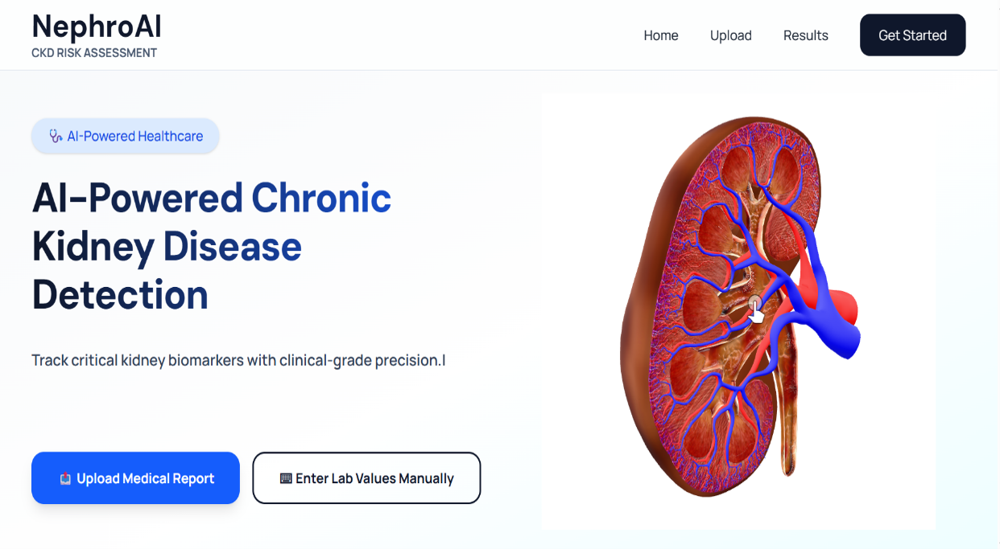
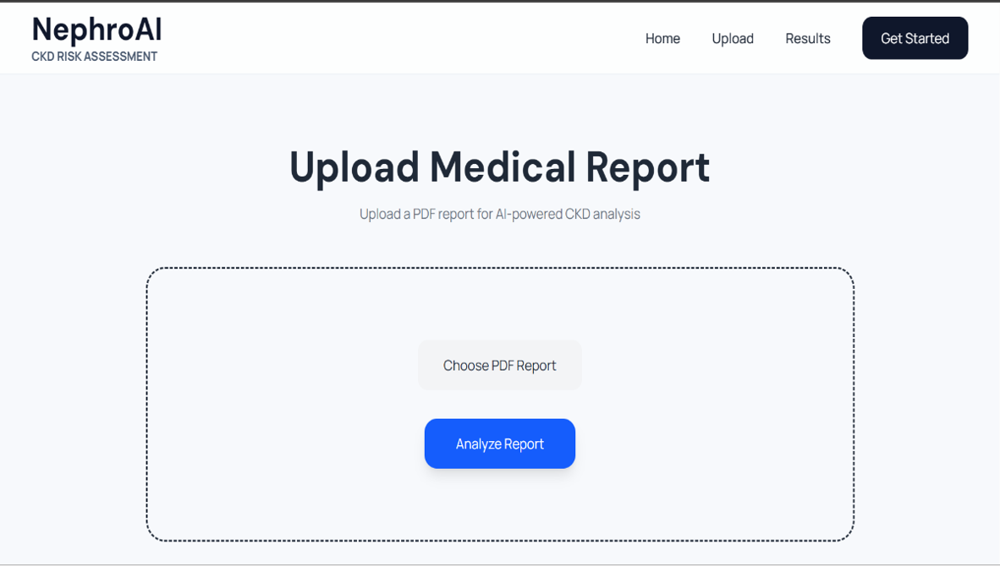
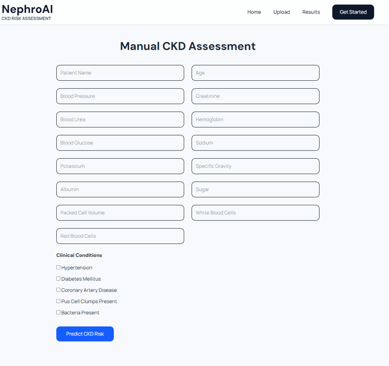
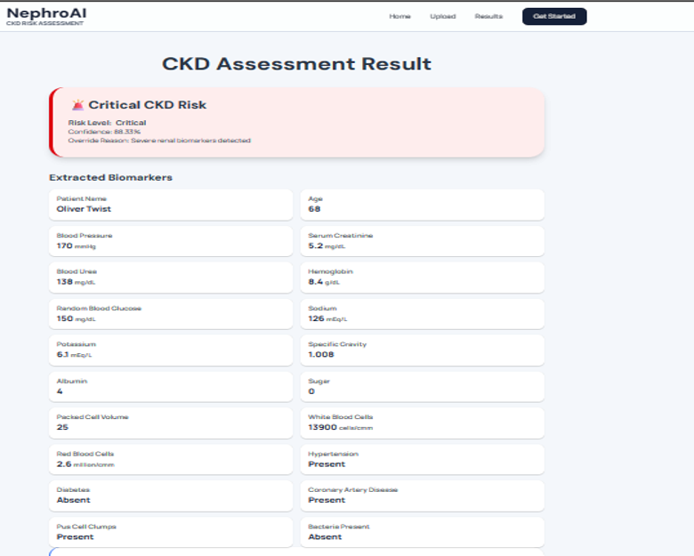
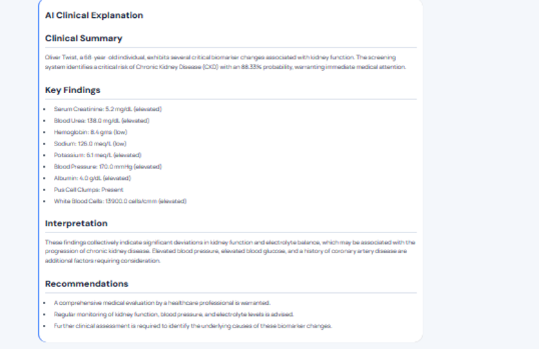
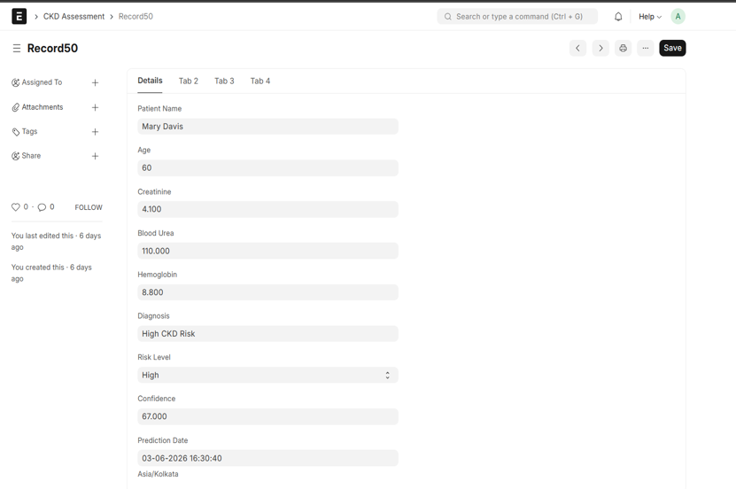

# NephroAI

### AI-Powered Healthcare Data Pipeline for Chronic Kidney Disease Risk Assessment

NephroAI is a full-stack healthcare application that processes patient laboratory data, extracts relevant clinical biomarkers from PDF reports, performs Chronic Kidney Disease (CKD) risk assessment using a machine learning model, generates AI-assisted clinical explanations, and stores assessment information through ERPNext integration.

---

## Overview

Chronic Kidney Disease is a progressive condition where early identification of abnormal clinical indicators can be important for timely medical evaluation. However, laboratory reports often contain information in unstructured formats, requiring manual review and interpretation.

NephroAI was developed as an AI-integrated healthcare data pipeline to automate several stages of this process.

The system accepts patient information through two methods:

1. **Laboratory PDF Upload** – Clinical values are extracted automatically from laboratory reports.
2. **Manual Entry** – Clinical parameters can be entered directly through the web application.

The extracted or entered data is processed through a feature engineering pipeline and passed to a machine learning model for CKD risk assessment. The prediction is then combined with relevant patient information and provided to Google Gemini to generate a structured, human-readable clinical explanation.

The resulting assessment can also be stored in ERPNext, allowing the AI-based assessment system to be connected with an enterprise healthcare record-management workflow.

> **Note:** NephroAI is intended as an assessment and decision-support application and is not a replacement for professional medical diagnosis.

---

## Features

### 1. Laboratory Report Processing

Users can upload laboratory reports in PDF format. The backend processes the report and extracts relevant clinical information.

The system can extract parameters including:

* Age
* Blood Pressure
* Specific Gravity
* Albumin
* Sugar
* Blood Glucose
* Blood Urea
* Serum Creatinine
* Sodium
* Potassium
* Hemoglobin
* Packed Cell Volume
* White Blood Cell Count
* Red Blood Cell Count

The extracted values are validated and transformed before being passed to the prediction pipeline.

---

### 2. Manual Patient Entry

The application also provides a manual assessment interface where users can enter patient information and clinical parameters directly.

The manual interface supports parameters such as:

* Patient Name
* Age
* Blood Pressure
* Serum Creatinine
* Blood Urea
* Hemoglobin
* Blood Glucose
* Sodium
* Potassium
* Specific Gravity
* Albumin
* Sugar
* Packed Cell Volume
* White Blood Cell Count
* Red Blood Cell Count
* Hypertension
* Diabetes Mellitus
* Coronary Artery Disease
* Pus Cell Clumps
* Bacteria

---

### 3. Machine Learning-Based CKD Risk Assessment

The processed patient data is passed through the machine learning prediction pipeline.

The system produces:

* Diagnosis
* Risk Level
* Confidence Score
* CKD Probability
* No-CKD Probability

The prediction pipeline also includes engineered clinical indicators and rule-based checks for selected abnormal biomarkers.

---

### 4. Feature Engineering

The system performs feature engineering before prediction.

Examples include:

* Creatinine Risk
* Glucose Risk
* Sodium Anomaly Detection
* Potassium Anomaly Detection
* White Blood Cell Alert Flag

Feature engineering allows the raw clinical parameters to be transformed into features suitable for the prediction model.

---

### 5. Generative AI Clinical Explanation

Google Gemini API is integrated to generate a structured explanation of the assessment.

The generated response contains sections such as:

* Clinical Summary
* Key Findings
* Interpretation
* Recommendations

The purpose of this component is to make the machine learning output easier to understand rather than simply presenting a numerical prediction.

---

### 6. ERPNext Integration

NephroAI supports integration with ERPNext through its REST API.

The system can create a **CKD Assessment** record containing relevant patient information, clinical values, prediction results, and assessment details.

For PDF-based assessments, the original report can also be associated with the assessment record.

---

### 7. Cloud Deployment

The application was developed with separate frontend and backend services.

* **Frontend:** Vercel
* **Backend:** Render

Environment variables are used to configure API endpoints and external service credentials.

---

## Tech Stack

| Category             | Technology          | Purpose                                  |
| -------------------- | ------------------- | ---------------------------------------- |
| Programming Language | Python              | Backend, data processing and ML pipeline |
| Programming Language | JavaScript          | Frontend development                     |
| Frontend             | React.js            | User interface                           |
| Frontend Tooling     | Vite                | Frontend development and build           |
| Styling              | Tailwind CSS        | Responsive UI design                     |
| Backend              | FastAPI             | REST API and backend services            |
| Data Processing      | Pandas              | Data processing and transformation       |
| Numerical Computing  | NumPy               | Numerical operations                     |
| Machine Learning     | Scikit-Learn        | CKD prediction model                     |
| PDF Processing       | PDFPlumber          | PDF text extraction                      |
| Generative AI        | Google Gemini API   | Clinical explanation generation          |
| ERP                  | ERPNext             | Assessment record management             |
| 3D Visualization     | Google Model Viewer | Interactive kidney model                 |
| Version Control      | Git                 | Source-code version control              |
| Repository           | GitHub              | Code hosting and deployment integration  |
| Frontend Hosting     | Vercel              | Frontend deployment                      |
| Backend Hosting      | Render              | Backend deployment                       |

---

## Architecture

NephroAI follows a modular architecture in which the frontend communicates with the FastAPI backend, while the backend coordinates data processing, machine learning, Generative AI, and ERPNext services.

### High-Level Architecture

```text
                    ┌─────────────────────┐
                    │       User          │
                    └──────────┬──────────┘
                               │
                  ┌────────────▼────────────┐
                  │    React Frontend       │
                  │       (Vercel)          │
                  └────────────┬────────────┘
                               │
                         REST API
                               │
                  ┌────────────▼────────────┐
                  │    FastAPI Backend      │
                  │       (Render)          │
                  └────────────┬────────────┘
                               │
             ┌─────────────────┼─────────────────┐
             │                 │                 │
             ▼                 ▼                 ▼
      ┌─────────────┐  ┌──────────────┐  ┌──────────────┐
      │ PDF         │  │ Feature      │  │ ML Prediction│
      │ Processing  │  │ Engineering  │  │ Pipeline     │
      └─────────────┘  └──────────────┘  └───────┬──────┘
                                                  │
                                                  ▼
                                      ┌────────────────────┐
                                      │ Google Gemini API  │
                                      │ Clinical           │
                                      │ Explanation        │
                                      └──────────┬─────────┘
                                                 │
                                                 ▼
                                      ┌────────────────────┐
                                      │   CKD Assessment   │
                                      │       Result       │
                                      └──────────┬─────────┘
                                                 │
                                                 ▼
                                      ┌────────────────────┐
                                      │      ERPNext       │
                                      │ Assessment Record  │
                                      └────────────────────┘
```

---

## How It Works

### Step 1 – Data Input

The user either uploads a laboratory PDF report or enters patient information manually.

```text
PDF Report
     OR
Manual Entry
```

---

### Step 2 – PDF Extraction

For PDF-based assessments, the backend extracts text from the uploaded report using PDFPlumber.

Relevant clinical parameters are identified from the extracted text.

```text
PDF
 ↓
Text Extraction
 ↓
Biomarker Identification
 ↓
Structured Patient Data
```

---

### Step 3 – Data Processing

The extracted data is cleaned and converted into numerical values where required.

Missing parameters are handled using the application's preprocessing and default-value mechanisms.

---

### Step 4 – Feature Engineering

Additional features are generated from the clinical data.

For example:

```text
Clinical Values
      ↓
Feature Engineering
      ↓
Risk Indicators
      ↓
Model-Ready Data
```

---

### Step 5 – Machine Learning Prediction

The processed data is passed to the CKD prediction model.

The prediction pipeline generates:

```text
Diagnosis
Risk Level
Confidence
CKD Probability
No-CKD Probability
```

---

### Step 6 – Clinical Rule Processing

Selected clinical indicators are also checked as part of the assessment pipeline.

For example, abnormal renal biomarkers can be considered when determining the final assessment.

This provides an additional layer alongside the machine learning prediction.

---

### Step 7 – Generative AI Explanation

The prediction and relevant patient information are passed to Google Gemini.

Gemini generates a structured explanation containing:

```text
Clinical Summary
        ↓
Key Findings
        ↓
Interpretation
        ↓
Recommendations
```

---

### Step 8 – ERPNext Integration

The assessment information can then be sent to ERPNext through its REST API.

The resulting CKD Assessment record can contain:

* Patient information
* Clinical values
* Diagnosis
* Risk level
* Confidence
* CKD probability
* No-CKD probability
* Prediction date
* Clinical condition indicators
* Original report reference, where applicable

---

### Step 9 – Result Display

The final assessment is returned to the React frontend and displayed to the user.

The interface presents the prediction and AI-generated explanation in a structured format.

---

## Results

The developed system successfully demonstrated an end-to-end healthcare data processing workflow.

### PDF Assessment

The system can:

```text
Upload Laboratory Report
        ↓
Extract Clinical Values
        ↓
Process Patient Data
        ↓
Predict CKD Risk
        ↓
Generate AI Explanation
        ↓
Display Results
```

### Manual Assessment

The system also supports:

```text
Enter Patient Data
        ↓
Validate & Process Data
        ↓
Predict CKD Risk
        ↓
Generate AI Explanation
        ↓
Display Results
```

### ERPNext

The ERPNext integration was implemented and tested for creating CKD Assessment records through API communication.

### Example Prediction Output

A prediction response can contain information such as:

```text
Diagnosis: High CKD Risk
Risk Level: High
Confidence: 67.67%

CKD Probability: 67.67%
No CKD Probability: 32.33%

Reason:
Abnormal renal biomarkers detected
```

The confidence value represents the model's probability estimate and should not be interpreted as medical certainty.

---

## Screenshots

### 1. Home Page



**Figure:** NephroAI Home Page with interactive kidney visualization.

---

### 2. PDF Upload Interface



**Figure:** Laboratory Report Upload Interface.

---

### 3. Manual Assessment



**Figure:** Manual CKD Assessment Interface.

---

### 4. Prediction Results



**Figure:** CKD Risk Prediction Results.

---

### 5. AI Clinical Explanation



**Figure:** AI-Generated Clinical Explanation.

---

### 6. ERPNext Assessment



**Figure:** CKD Assessment Record in ERPNext.


---

## Installation

### Prerequisites

Make sure the following are installed:

* Python
* Node.js
* npm
* Git

ERPNext is required only if ERP functionality is being tested locally.

---

### 1. Clone the Repository

```bash
git clone <YOUR_GITHUB_REPOSITORY_URL>
cd <PROJECT_DIRECTORY>
```

---

### 2. Backend Setup

Navigate to the backend directory:

```bash
cd backend
```

Create a Python virtual environment:

```bash
python -m venv .venv
```

Activate it on Windows:

```bash
.venv\Scripts\activate
```

Install the required packages:

```bash
pip install -r requirements.txt
```

---

### 3. Configure Backend Environment Variables

Create a `.env` file in the backend directory.

```env
GOOGLE_API_KEY=YOUR_GOOGLE_API_KEY

ERP_URL=YOUR_ERPNEXT_URL
API_KEY=YOUR_ERPNEXT_API_KEY
API_SECRET=YOUR_ERPNEXT_API_SECRET
```

Do **not** commit the actual `.env` file or API credentials to GitHub.

A `.env.example` file can be provided with placeholder values.

---

### 4. Run the Backend

```bash
uvicorn main:app --reload
```

The API will normally be available at:

```text
http://127.0.0.1:8000
```

FastAPI automatically provides interactive API documentation at:

```text
http://127.0.0.1:8000/docs
```

---

### 5. Frontend Setup

Open another terminal and navigate to the frontend directory:

```bash
cd frontend
```

Install dependencies:

```bash
npm install
```

Create the frontend environment file:

```env
VITE_API_URL=http://127.0.0.1:8000
```

Start the development server:

```bash
npm run dev
```

Vite will display the local URL in the terminal, usually:

```text
http://localhost:5173
```

---

### 6. ERPNext Setup

If ERPNext integration is required:

1. Start the ERPNext instance.
2. Create the required **CKD Assessment** DocType.
3. Generate an ERPNext API key and API secret.
4. Add the credentials to the backend `.env` file.
5. Start the FastAPI backend.
6. Perform a CKD assessment.
7. Verify that the assessment record is created in ERPNext.

---

## Usage

### PDF-Based Assessment

1. Open the NephroAI web application.
2. Navigate to the report upload section.
3. Select a laboratory PDF.
4. Upload the report.
5. Wait for the backend to process the document.
6. Review the extracted clinical values.
7. View the CKD prediction.
8. Review the AI-generated clinical explanation.
9. Verify the assessment record in ERPNext if ERP integration is enabled.

---

### Manual Assessment

1. Open the Manual CKD Assessment page.
2. Enter the patient's information.
3. Enter the available clinical parameters.
4. Select relevant clinical conditions.
5. Click **Predict CKD Risk**.
6. Review the prediction results.
7. Review the generated clinical explanation.
8. Verify the ERPNext assessment record if integration is enabled.

---

## API Endpoints

The FastAPI backend provides endpoints for the main application workflows.

### Manual Prediction

```text
POST /predict-manual
```

Used to process manually entered patient information and return a CKD assessment.

### API Documentation

```text
GET /docs
```

Provides interactive Swagger documentation for the available FastAPI endpoints.

> Additional endpoints may be present in the backend depending on the current implementation.

---

## Deployment

### Frontend

The React frontend is deployed using **Vercel**.

### Backend

The FastAPI backend is deployed using **Render**.

### Version Control

The source code is maintained using **Git and GitHub**.

Environment-specific configuration is handled using environment variables rather than hardcoding credentials into the source code.

---

## Future Improvements

The following improvements can be considered for future versions of NephroAI:

### 1. OCR Support

Add OCR capabilities to support scanned laboratory reports and image-based PDFs.

### 2. Improved PDF Extraction

Expand the extraction pipeline to support a wider variety of laboratory report layouts and naming conventions.

### 3. Explainable AI

Add visual explanations such as feature importance and the major factors contributing to a prediction.

### 4. Patient History

Introduce a patient dashboard for viewing previous assessments and tracking changes over time.

### 5. Authentication

Implement secure user authentication and role-based access for different types of users.

### 6. Advanced ERP Deployment

Deploy ERPNext in an appropriately secured cloud environment to enable reliable cloud-to-cloud communication with the deployed application.

### 7. Model Evaluation

Expand model evaluation with comprehensive test-set metrics such as accuracy, precision, recall, F1-score, ROC-AUC, and confusion matrix analysis.

### 8. Scalability

Improve backend architecture and infrastructure to support larger numbers of users and concurrent assessments.

---

## Project Limitations

* PDF extraction performance depends on the structure and formatting of the uploaded laboratory report.
* The system is primarily designed around the clinical parameters supported by the current prediction pipeline.
* Machine learning probabilities represent model estimates and should not be interpreted as definitive medical diagnoses.
* Full production deployment of healthcare systems requires appropriate security, privacy, validation, and clinical oversight.

---

## Author

**Akhilesh Mohan**

B.Tech – Computer Science and Business Systems
Rajagiri School of Engineering and Technology (RSET), Kochi

### Internship

**Organization:** AODG
**Duration:** 11 May 2026 – 5 June 2026
**Project:** NephroAI – AI-Powered Healthcare Data Pipeline for Chronic Kidney Disease Risk Assessment
